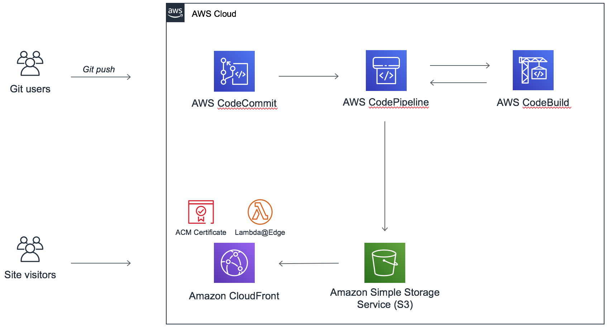

# Git -> AWS Code* -> S3 hosted Hugo website 

## Overview

This project contains an AWS Cloud Development Kit (CDK) template that creates a CodeCommit Git repository, and a static website hosted in Amazon S3, fronted by and Amazon CloudFront CDN. Additionally, it creates the necessary AWS CodeBuild and AWS CodePipeline projects so that every change to content in the Git repository is automatically deployed to the static web site. Finally, an AWS Lambda@Edge function is created to preserve clean URLs in the website (while still protecting the S3 bucket from direct access).

Envrionment variables are used to provide a domain name and an Amazon Certificate Manager ARN, as well as an optional Hugo version and SHA256 checksum.

Benefits of this architecture include:

Easy to deploy - Use the AWS CDK CLI to deploy the infrastructure, then check out the repo and start creating content with Hugo.

Fully managed/scalable - All services leveraged are 100% managed and require no manual scaling or scaling policy creation based on traffic volume is required.

Low cost - Your costs may vary over time and if other resources are running in your AWS account.

## Table of Contents
* [Architecture](#architecture)
* [Launch the Infrastructure](#infrastructure)
  * [Install the AWS CDK](#installcdk)
  * [Clone this repository](#clonecdkrepo)
  * [Install the required npm modules](#npminstall)
  * [Compile the project (convert the TypeScript files to JavaScript)](#compileproject)
  * [Provide the inputs](#npminstall)
  * [Install the required npm modules](#provideinputs)
    * [AWS CDK context](#cdkcontext)
    * [Environment variables](#envvars)
  * [Validate CDK can see the stack and compile the template](#cdkvalidate)
  * [Deploy the stack](#cdkdeploy)
* [Create your Hugo website](#createsite)
* [Useful AWS CDK commands](#cdkcommands)

## Architecture <a name="architecture"></a>



## Launch the Infrastructure <a name="infrastructure"></a>

Follow the steps below to go from CDK installation to publishing your first Hugo post.

### Install the AWS CDK <a name="installcdk"></a>

Follow the latest instructions from the [AWS CDK website](https://docs.aws.amazon.com/CDK/latest/userguide/install_config.html) to install the CLI. You should be able to check the version from the CLI (your version may not match exactly).

```
$ cdk --version
0.22.0 (build 644ebf5)
```

### Clone this repository <a name="clonecdkrepo"></a>

Clone this repo to your local machine and switch to that directory.

```
$ git clone https://github.com/mikeapted/aws-cdk-hugo-s3.git my-hugo-website
Cloning into 'my-hugo-website'...
remote: Enumerating objects: 44, done.
remote: Counting objects: 100% (44/44), done.
remote: Compressing objects: 100% (18/18), done.
remote: Total 44 (delta 19), reused 40 (delta 15), pack-reused 0
Unpacking objects: 100% (44/44), done.

$ cd my-hugo-website
```

### Install the required npm modules <a name="npminstall"></a>

```
npm i
```

### Compile the project (convert the TypeScript files to JavaScript) <a name="compileproject"></a>

```
npm run build
```

### Provide the inputs <a name="provideinputs"></a>

Set the domain name your site will use (apex domain, the www. will be added automatically), and ACM ARN for the CloudFront distribution (and the optional Hugo version and SHA256) using either the AWS CDK context or envrionment variables (they are used in that order of preference).

#### AWS CDK context <a name="cdkcontext"></a>

Edit the cdk.json file in the root directory to update the values.

```
{
  "context": {
    "domain": "...",
    ...
  }
}
```

#### Environment variables <a name="envvars"></a>

```
$ export DOMAIN=...
$ export CERTIFICATE=...
$ export HUGO_VERSION=...
$ export HUGO_SHA256=...
```

### Validate CDK can see the stack and compile the template <a name="cdkvalidate"></a>

```
$ cdk ls
HugoAwsCdkStack
$ cdk synth
Resources:
  CodeCommitRepository...
  ...
```

### Deploy the stack <a name="cdkdeploy"></a>

If you have never used the CDK in the AWS account your credentials are configured for you will need to first bootstrap the CDK (creates a staging S3 bucket).

```
$ cdk bootstrap
```

Then deploy the stack to your account.

```
$ cdk deploy
```

## Create your Hugo website <a name="createsite"></a>

TBD

## Useful AWS CDK commands  <a name="cdkcommands"></a>

 * `npm run build`   compile typescript to js
 * `npm run watch`   watch for changes and compile
 * `cdk deploy`      deploy this stack to your default AWS account/region
 * `cdk diff`        compare deployed stack with current state
 * `cdk synth`       emits the synthesized CloudFormation template
